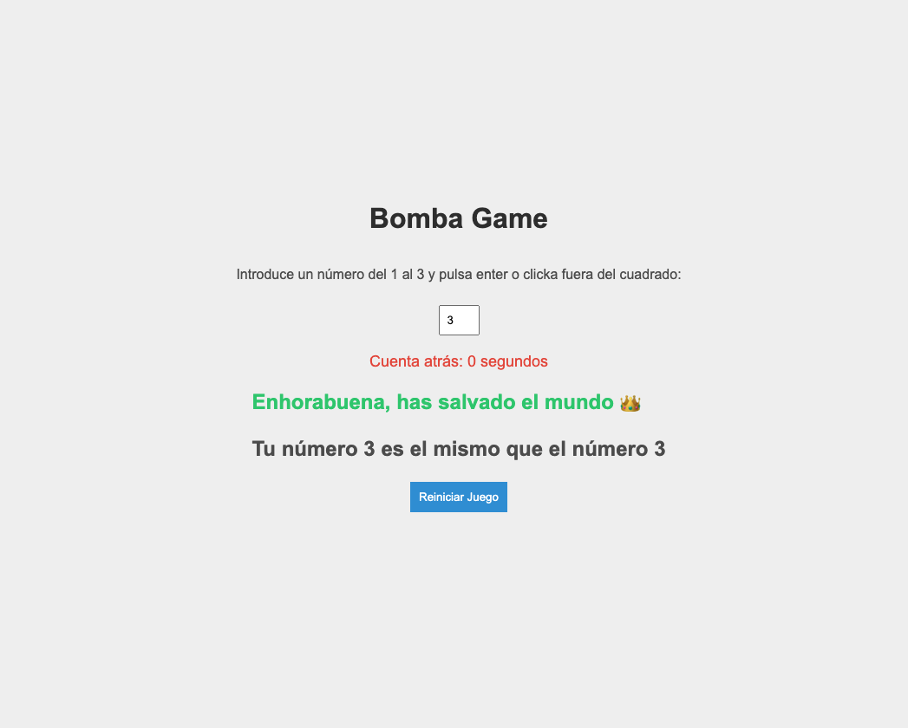

hazme un programa en JS con las siguientes características:
- EL juego tienen que tener un INPUT en el que se introduce un número de 1 a 9
- El juego se inicia con una cuenta atrás de 10 segundos. Cuando se acaba la cuenta atrás tiene que verificar si el número aleatorio y el número introducido por el usuario coinciden. Si coinciden pondrá un mensaje en el DOM que diga: "has salvado el mundo" y sino un mensaje que diga "la bomba ha estallado,. con un emoji de una bomba"

# Bomba Game

## Descripción
El juego genera un número aleatorio del 1 al 3 y presenta una cuenta atrás de 5 segundos. Después de la cuenta atrás, compara el número aleatorio con el número introducido por el usuario. Si coinciden, se muestra un mensaje de "¡Has salvado el mundo!", de lo contrario, se muestra "La bomba ha estallado". En ambos casos tendrá que salir el núemro elegido y junto con el número correcto (el generado aleatoriamente). No se sabrá que número es hasta que pasen 5 segundos.

## Instrucciones

1. Abre el archivo `index.html` en tu navegador.
2. Introduce un número del 1 al 3 en el campo de entrada.
3. El juego se iniciará automáticamente con una cuenta atrás de 5 segundos.
4. Después de la cuenta atrás, el juego evaluará el número introducido.
5. Se mostrará un mensaje indicando si has salvado el mundo o si la bomba ha estallado.

## Reiniciar el Juego

Puedes reiniciar el juego en cualquier momento haciendo clic en el botón "Reiniciar Juego". Esto comenzará una nueva cuenta atrás y permitirá que ingreses otro número.

## Estilos

Los estilos del juego están definidos en el archivo `styles.css`. Puedes personalizar estos estilos según tus preferencias.

Debe quedar algo similar a esto

## Pistas
- Puedes usar `setTimeout()` para generar la asincronía de 5 segundos
- Puedes usar `setInterval()` para generar la asincronía de 5 segundos (recuerda que es del 5 al 0, por tanto el intervalo debería ser uno más) 5, 4, 3, 2, 1, 0 ...
- Usa promesas para una vez pasado ese tiempo devuelva el resultado y puedas trabajar con él
- Crea un botón de reinicio del juego voviendo a iniciar la función inicial o reiniciando la página al pulsarlo.